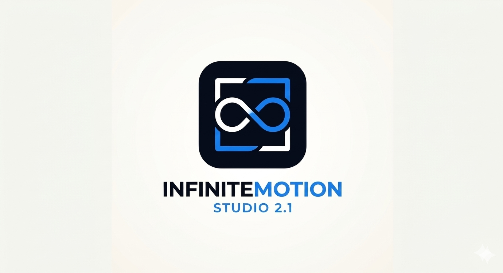
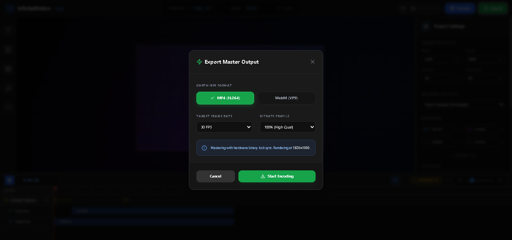
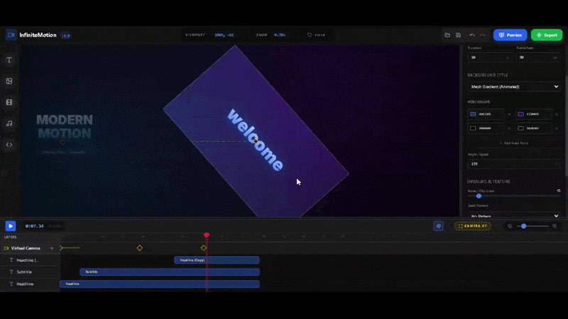
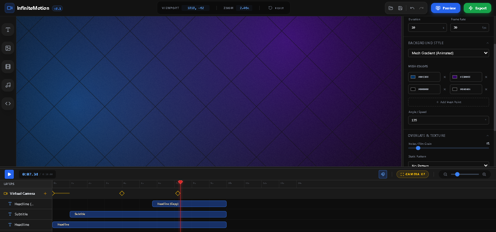
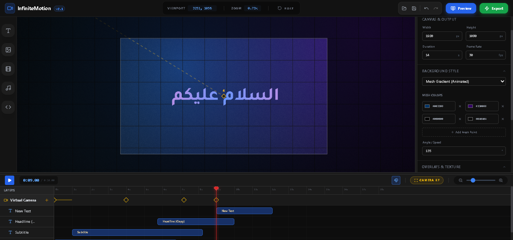
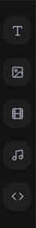
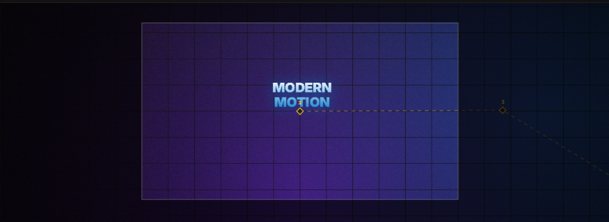
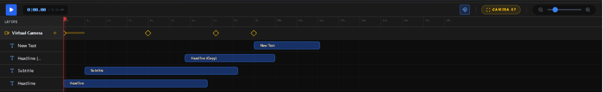
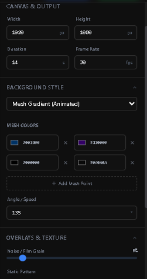
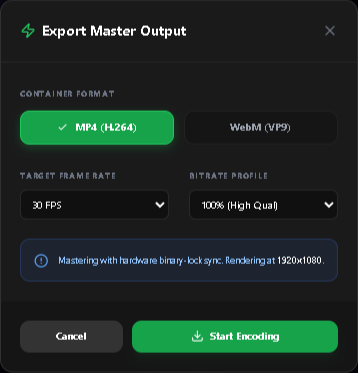

  

  # InfiniteMotion Studio 2.1

  **برنامج لتحرير الفيديو يسمح لك بالعمل داخل مساحة أو بيئة حيث يمكنك تحريك الكاميرا والعناصر داخل المشهد كما لو أنك تعمل داخل مكان حقيقي. احترافي، يتميز بمساحة عمل لا نهائية، كاميرا افتراضية (Deterministic Hardware Rendering)، وإمكانيات متقدمة في تصميم الموشن جرافيك.**

  
  
  
  

---

مرحباً بك في **InfiniteMotion Studio**، لتحرير الفيديو مباشرة من المتصفح. بُنيت هذه المنصة كبرمجية احترافية مغلقة المصدر لتتجاوز قيود مساحات العمل التقليدية وتقدم تجربة حركة سينمائية. يمكن للمستخدمين تحريك العناصر ديناميكياً، التحكم بكاميرا افتراضية للتنقل داخل المشاهد، يمكن اضافة أكواد HTML/CSS برمجية كل ذلك يتم العمل عليه  وتصديره محلياً عبر مسار (Pipeline) مخصص يعتمد على تسريع العمليه باستخدام WebCodecs.

## 🏗️ بنية النظام والابتكارات التقنية

نظراً لأن InfiniteMotion Studio يمثل قاعدة برمجية خاصة، يقدم هذا القسم نظرة عامة على القرارات الهندسية و العمال التي تشغل المنصة.

### 1. محرك عمل Canvas مخصص
يعتمد الاستوديو في الأساس على طريقة عالية الكفاءة لعرض ومعالجة الرسوم باستخدام تقنية ‎HTML5 Canvas‎، وقد تم تحسينها لتقديم أداء سريع وسلس.
*   **استخدام الارقام لتحديد الاماكن** يتم تحديد موقع العناصر في المشهد، وتدويرها، وتغيير حجمها بالعتماد على حساب المصفوفات، مما يسمح بالتحريك والتكبير داخل مساحة دون فقدان الدقة.
*   **الخلفيات الديناميكية** يمكنك انشاء خلفيات مختلفة بشكل جميل، مثل تدرج الالوان و تحركها و اضافة اشكال شبكات مختلفة،
*   **الدمج  بين DOM وCanvas** بينما يتم رسم العناصر العادية مثل الفيديو والصور والنصوص مباشرةً على الـCanvas، يتم عرض عناصر "الكود" (مثل ‎HTML‎ و‎CSS‎ و‎SVG‎) من خلال طبقة ‎DOM‎ متزامنة فوقها. هذه الطبقة تتبع بدقة حركة الكاميرا الافتراضية وتحويلاتها، مما يسمح لتأثيرات ورسوم ‎CSS‎ المتحركة بالاندماج بسلاسة داخل مساحة الفيديو.

### 2. التصدير ومزامنة الوسائط

تصدير فيديو عالي الجودة مباشرة من المتصفح.
*   **دمج WebCodecs** يستخدم مسار التصدير واجهات ‎VideoEncoder‎ و‎AudioEncoder‎ منخفضة المستوى لتسجيل الإطارات مباشرة في ملفات ‎MP4‎ (H.264/AAC) أو ‎WebM‎ (VP9/Opus)، مما يضمن جودة عالية وتحكم دقيق في الفيديو والصوت.
*   **مزامنة الإطارات بقفل ثنائي (Binary-Lock):** لضمان عدم حذف أي إطار أثناء التصدير، استخدمنا في المحرك آلية قفل مخصصة توقف حلقة العمل (Render Loop) مؤقتاً حتى تؤكد عناصر `HTMLVideoElement` أن حالة `readyState` قد قامت بتخزين الإطار المطلوب بدقة.
*   **المكساج عبر OfflineAudioContext:** لا يتم مجرد تسجيل الصوت؛ بل تُدمج وتُوزن وتُصيّر بالكامل داخل ذاكرة (Float32) باستخدام `OfflineAudioContext` من واجهة Web Audio API قبل دمجها (Multiplexing) في الفيديو النهائية.

### 3. إدارة الحالة الذكية والاستيفاء (Interpolation)
تُدار حالة التطبيق عبر مكدس سجل (History Stack) صارم وغير قابل للتغيير (Immutable)، مما يتيح التراجع والإعادة الفورية دون أي تأثير على الأداء.
*   **توليد الإطارات المفتاحية تلقائياً (Auto-Keyframing):** يكتشف المحرك التغيرات المكانية (X، Y، الحجم، الدوران) ويقوم بإنشاء أو تحديث الإطارات المفتاحية تلقائياً.
*   **تخفيف الحركة المتقدم (Advanced Easing):** تتم معالجة الاستيفاء بين الإطارات المفتاحية بواسطة دوال رياضية مخصصة تدعم تأثيرات تخفيف معقدة مثل `bounce-in`، `bounce-out`، و `elastic`، وتُحسب بدقة لكل إطار.
*   **مُحفزات التقاطع (Intersection Triggers):** تتميز الأصول بحركات دخول وخروج لا تعتمد على الوقت فحسب، بل على التقاطع المكاني. يحسب المحرك متى يدخل العنصر في مجال رؤية الكاميرا الافتراضية ويقوم بتركيب/إزالة (Mount/Unmount) حالة العنصر ديناميكياً.

## ✨ الميزات الرئيسية

*   🎥 **التحرير المكاني والكاميرا الافتراضية:** صمم على مساحة عمل لا نهائية. حرك كاميرا افتراضية (Pan, Zoom, Rotate) للتحليق داخل المشهد وإنشاء حركات ديناميكية بأسلوب العروض التقديمية.
*   ⏱️ **خط زمني احترافي مع ميزة الجذب (Snapping):** خط زمني متكامل (NLE) يدعم الجذب المغناطيسي (للمقاطع، الإطارات المفتاحية، ومؤشر التشغيل)، التحديد المربع (Marquee Selection)، وسهولة إعادة ترتيب الطبقات بالسحب والإفلات.
*   ⚡ **تصدير مسرّع عتادياً:** اخبز مشاهدك السينمائية مباشرة في المتصفح باستخدام WebCodecs API. صدّر فيديو عالي الدقة ومتزامن صوتياً بصيغ **MP4 (H.264/AAC)** أو **WebM (VP9/Opus)**.
*   🎨 **تنسيقات وتأثيرات متقدمة:** دعم التدرجات الشبكية المتحركة، تأثيرات الزجاج المغشى، الظلال، الحدود (Strokes)، وأقنعة العناصر (Masking) المعقدة.
*   💻 **حقن الأكواد البرمجية (Raw Code):** أضف أصول "Code" لحقن HTML، CSS، و SVG مباشرة في مسار التصيير لفتح آفاق بصرية لا حصر لها.

## 🌌 الخلفيات، الشبكات، وخامات مساحة العمل

يوفر InfiniteMotion Studio تخصيصاً عميقاً للأساس البصري لمشروعك، مما يتيح لك بناء تكوينات غنية ومليئة بالتفاصيل قبل إضافة أي عنصر.

*   **أنواع الخلفيات الديناميكية:** اختر من بين الألوان الثابتة، التدرجات الخطية، التدرجات الدائرية، الزجاج المغشى، أو **التدرج الشبكي المتحرك (Animated Mesh Gradient)** المتقدم (والذي يمزج حتى 8 ألوان مخصصة مع إمكانية التحكم بالسرعة والزاوية).
*   **شبكات المحرر (Editor Grids):** قم بتفعيل شبكة مساحة العمل للمساعدة في المحاذاة المكانية. اختر من بين أنماط *الخطوط، النقاط، التقاطعات،* أو *المنظور الأيزومتري*. يمكنك اختيار أي لون للشبكة وتحديد ما إذا كنت تريد ظهورها في الفيديو النهائي المُصدَّر.
*   **التراكبات والخامات:** أضف لمسة سينمائية مع إمكانية تعديل **حبيبات الفيلم / الضجيج (Film Grain / Noise)** وتراكبات هيكلية مثل *النقاط الدقيقة، الشبكات التقنية،* أو *خطوط شاشات CRT*. اضبط شفافية هذه الأنماط لإنشاء أي طابع تريده، بدءاً من تأثيرات VHS الكلاسيكية وحتى الواجهات التقنية الحديثة والأنيقة.

## 🔤 الطباعة ودعم اللغة العربية

صُمم InfiniteMotion Studio ليناسب المبدعين من جميع أنحاء العالم، حيث يضم محرك تصيير نصوص قوي يدعم تشكيل النصوص المعقدة، اللغات التي تُكتب من اليمين إلى اليسار (RTL)، والطباعة (Typography) الأنيقة.

*   **خطوط قياسية ممتازة:** يأتي محملاً مسبقاً بمجموعة منتقاة بعناية من الخطوط الحديثة بما في ذلك *Inter, Roboto, Open Sans, Lato, Montserrat, Poppins, Oswald, Playfair Display, Merriweather, Nunito,* و *Raleway*.
*   **دعم أصلي للغة العربية:** يُصيّر المحرك النصوص العربية المتصلة بدقة متناهية دون كسر الروابط بين الأحرف (Ligatures).
*   **خطوط عربية منتقاة:** وصول فوري لأرقى الخطوط العربية المصممة للموشن جرافيك عالي الجودة، مثل *Cairo, Almarai, Tajawal, Amiri, El Messiri,* و *Lateef*.
*   **تنسيق نصوص متقدم:** قم بتطبيق تدرجات خطية/دائرية، حدود مخصصة (Strokes)، هوامش (Padding)، خلفيات دائرية، وظلال مباشرة على طبقات النصوص، بغض النظر عن اللغة المستخدمة.

## ⌨️ اختصارات لوحة المفاتيح

تم تصميم InfiniteMotion Studio للمحررين المحترفين، حيث يوفر مجموعة شاملة من اختصارات لوحة المفاتيح لتسريع سير عمل التحرير المكاني.

### عام والتشغيل
| الإجراء | الاختصار (Windows / Mac) |
| :--- | :--- |
| **تشغيل / إيقاف مؤقت** | `Space` |
| **تراجع** | `Ctrl` + `Z` / `Cmd` + `Z` |
| **إعادة** | `Ctrl` + `Shift` + `Z` / `Cmd` + `Shift` + `Z` |
| **حذف المحدد** | `Delete` أو `Backspace` |

### التنقل في مساحة العمل
| الإجراء | الاختصار (Windows / Mac) |
| :--- | :--- |
| **تحريك مساحة العمل (أداة اليد)** | الاستمرار بالضغط على `Space` + `سحب بالماوس` |
| **تقريب/تبعيد مساحة العمل** | `عجلة الماوس` / `تمرير لوحة اللمس` |
| **تدوير الكاميرا الافتراضية** | الاستمرار بالضغط على `Alt` / `Option` + `سحب بالماوس` (في مساحة فارغة) |

### التعامل مع الأصول
| الإجراء | الاختصار (Windows / Mac) |
| :--- | :--- |
| **إزاحة العنصر (بكسل واحد)** | `مفاتيح الأسهم` |
| **إزاحة سريعة (10 بكسل)** | `Shift` + `مفاتيح الأسهم` |
| **تكرار العنصر** | الاستمرار بالضغط على `Alt` / `Option` + `سحب العنصر` |
| **الحفاظ على الأبعاد** | الاستمرار بالضغط على `Shift` + `سحب مقبض التحجيم` |
| **تدوير بزوايا ثابتة (15 درجة)** | الاستمرار بالضغط على `Shift` + `سحب مقبض التدوير` |

### التحديد
| الإجراء | الاختصار (Windows / Mac) |
| :--- | :--- |
| **تحديد متعدد** | الاستمرار بالضغط على `Shift` + `نقر` |
| **تحديد مربع (Marquee)** | الاستمرار بالضغط على `Ctrl` / `Cmd` + `سحب بالماوس` (يعمل على مساحة العمل والخط الزمني) |

### مشغل المعاينة بملء الشاشة
| الإجراء | الاختصار (Windows / Mac) |
| :--- | :--- |
| **تشغيل / إيقاف مؤقت** | `Space` |
| **تخطي للأمام / للخلف 5 ثوانٍ** | `السهم الأيمن` / `السهم الأيسر` |
| **تبديل وضع ملء الشاشة** | `F` |
| **الخروج من المعاينة** | `Esc` |

## 🛠️ التقنيات المستخدمة

**إطار عمل الواجهة الأمامية وتصميم المستخدم**
*   [React 19](https://react.dev/) - معمارية الواجهة
*   [TypeScript](https://www.typescriptlang.org/) - أمان الأنواع ومنطق التطبيق
*   [Tailwind CSS](https://tailwindcss.com/) - تنسيق سريع وعملي
*   [Lucide React](https://lucide.dev/) - أيقونات واضحة ومتناسقة

**محرك الوسائط والتصيير**
*   **HTML5 Canvas API** - محرك التصيير الأساسي
*   **WebCodecs API & OfflineAudioContext** - تشفير الإطارات عالي الأداء والمكساج الصوتي
*   [`mp4-muxer`](https://github.com/Vanilagy/mp4-muxer) & [`webm-muxer`](https://github.com/Vanilagy/webm-muxer) - دمج (Multiplexing) حاويات الوسائط داخل المتصفح

## 💡 نظرة عامة على سير العمل

### التنقل في مساحة العمل
* **مركز الأصول (اليسار):** أضف عناصر جديدة لمشروعك بسرعة. انقر على الأيقونات لإنشاء نصوص أو أكواد، رفع صور وفيديوهات، أو فتح اللوحة المخصصة للصوتيات لإدارة الموسيقى والمؤثرات الصوتية.
* 

*   **مساحة العمل (الوسط):** استخدم `Space + سحب بالماوس` للتحرك حول مساحة العمل اللانهائية. قم بالتمرير للتقريب/التبعيد. حدد الأصول لتحريكها، تغيير حجمها، أو تدويرها.
*   

*   **الخط الزمني (الأسفل):** حرّك مؤشر التشغيل لمعاينة حركتك. بدّل أيقونة **المغناطيس** لتفعيل/تعطيل ميزة الجذب (Snapping). استمر بالضغط على `Shift` واسحب لإنشاء تحديد مربع لمقاطع متعددة.
*   

*   **لوحة الخصائص (اليمين):** قم بتعديل خصائص الأصل المحدد حالياً أو الإطار المفتاحي للكاميرا. اضبط الخطوط، الألوان، حركات الدخول/الخروج، وتأثيرات الظلال.
*   

### إنشاء الحركات (Animations)
1.  **الإطارات المفتاحية للأصول:** حدد عنصراً في مساحة العمل. حرك مؤشر التشغيل في الخط الزمني. حرك العنصر في مساحة العمل—سيتم إنشاء إطار مفتاحي جديد تلقائياً!
2.  **الإطارات المفتاحية للكاميرا:** انقر على زر `Camera KF` في ترويسة الخط الزمني. حرك مؤشر التشغيل، ثم اضبط التقريب/التحريك (Zoom/Pan) من شريط الأدوات العلوي لإنشاء حركات كاميرا ديناميكية ومثيرة.

### تصدير مشروعك
1. انقر على زر **Export** في الزاوية العلوية اليمنى.
2. اختر الحاوية المطلوبة (`MP4` أو `WebM`)، معدل الإطارات (حتى 60 إطاراً في الثانية)، ومقياس الدقة.
3. انقر على **Start Encoding**. سيستخدم التطبيق معالج الرسوميات (GPU) المحلي لخبز الإطارات إطاراً تلو الآخر، مما يضمن التزامن المثالي قبل مطالبتك بتحميل الملف.

## 🔒 الترخيص

جميع الحقوق محفوظة. هذا المشروع وقاعدته البرمجية مغلقة المصدر ومملوكة بالكامل. لا يُسمح بتوزيعها مفتوحة المصدر، أو نسخها، أو تعديلها دون إذن كتابي صريح من صاحب حقوق الطبع والنشر.
