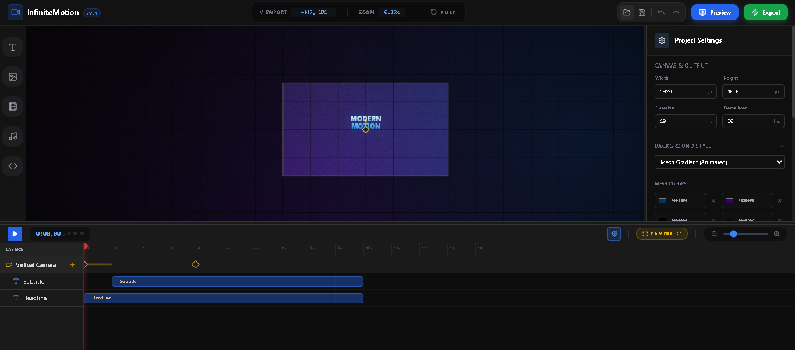

  

  # InfiniteMotion Studio 2.1

  **A proprietary, high-performance spatial video editor featuring an infinite canvas, virtual camera, deterministic hardware rendering, and advanced motion graphics capabilities.**

  
  
  
  

---

Welcome to **InfiniteMotion Studio**, a next-generation, browser-based video editing environment. Built as a closed-source, proprietary platform, InfiniteMotion breaks free from traditional constrained video canvases and introduces a spatial editing workflow. Users can animate elements dynamically, control a virtual camera to navigate complex scenes, and inject raw HTML/CSS—all baked and exported locally via a custom hardware-accelerated WebCodecs pipeline.

## 🏗️ System Architecture & Technical Innovations

Because InfiniteMotion Studio is a proprietary codebase, this section provides a high-level overview of the engineering and architectural decisions that power the platform.

### 1. Custom Canvas Rendering Engine
At the core of the studio is a highly optimized HTML5 Canvas rendering pipeline. 
*   **Matrix Math & Transformations:** Spatial positioning, rotation, and scaling are handled via custom matrix math utilities, allowing for infinite panning and zooming without losing precision.
*   **Dynamic Backgrounds:** The engine procedurally generates complex backgrounds, including animated mesh gradients (using overlapping radial composites), frosted glass overlays, and CRT scanline patterns in real-time.
*   **Hybrid DOM/Canvas Compositing:** While standard assets (video, image, text) are drawn directly to the canvas, "Code" assets (raw HTML/CSS/SVG) are rendered via a synchronized DOM overlay that perfectly tracks the virtual camera's matrix transformations, allowing for CSS animations to exist seamlessly within the video space.

### 2. Deterministic Export & Media Sync
Exporting high-fidelity video in the browser requires bypassing standard real-time playback limitations.
*   **WebCodecs Integration:** The export pipeline utilizes the low-level `VideoEncoder` and `AudioEncoder` APIs to bake frames directly to MP4 (H.264/AAC) or WebM (VP9/Opus) containers.
*   **Binary-Lock Frame Sync:** To ensure zero dropped frames during rendering, the engine uses a custom "binary-lock" mechanism that pauses the rendering loop until HTMLVideoElements confirm their `readyState` has buffered the exact required frame.
*   **OfflineAudioContext Mixing:** Audio tracks are not simply recorded; they are fully mixed, leveled, and rendered into a planar Float32 buffer using the Web Audio API's `OfflineAudioContext` before being multiplexed into the final video container.

### 3. Smart State Management & Interpolation
The application state is managed via a strict, immutable history stack that enables instant undo/redo functionality without performance degradation.
*   **Auto-Keyframing:** The engine detects spatial changes (X, Y, Scale, Rotation) and automatically generates or updates keyframes. 
*   **Advanced Easing:** Interpolation between keyframes is handled by custom math functions supporting complex easings like `bounce-in`, `bounce-out`, and `elastic`, calculated precisely per frame.
*   **Intersection Triggers:** Assets feature entrance and exit animations that are triggered not just by time, but by spatial intersection. The engine calculates when an asset enters the Virtual Camera's viewport and dynamically mounts/unmounts the asset state.

## ✨ Key Features

*   🎥 **Spatial Editing & Virtual Camera:** Design on an infinite canvas. Animate a virtual camera (pan, zoom, rotate) to fly through your scene, creating dynamic, presentation-style motion graphics.
*   ⏱️ **Professional Timeline & Snapping:** A fully-featured NLE timeline with magnetic snapping (clips, keyframes, playhead), marquee selection, and intuitive drag-and-drop layer reordering.
*   ⚡ **Hardware-Accelerated Export:** Bake your cinematic sequences directly in the browser using the WebCodecs API. Export high-fidelity, audio-synced video in **MP4 (H.264/AAC)** or **WebM (VP9/Opus)**.
*   🎨 **Advanced Styling & Effects:** Support for dynamic animated mesh gradients, frosted glass overlays, drop shadows, strokes, and complex object masking.
*   💻 **Raw Code Injection:** Add "Code" assets to inject raw HTML, CSS, and SVG directly into the rendering pipeline for limitless visual possibilities.

## 🌌 Backgrounds, Grids & Canvas Textures

InfiniteMotion Studio provides deep customization for your project's visual foundation, allowing you to build rich, textured compositions before adding a single asset.

*   **Dynamic Background Types:** Choose from Solid Colors, Linear Gradients, Radial Gradients, Frosted Glass, or the highly advanced **Animated Mesh Gradient** (which blends up to 8 custom colors with adjustable speed and angle).
*   **Editor Grids:** Toggle a customizable workspace grid to aid in spatial alignment. Choose from *Lines, Dots, Crosses,* or *Isometric* styles. You can pick any custom grid color and even choose whether the grid should be visible in your final exported video.
*   **Overlays & Textures:** Add cinematic polish with adjustable **Film Grain / Noise** and structural overlays like *Micro Dots, Technical Grids,* or *CRT Scanlines*. Fine-tune the opacity of these patterns to create everything from retro VHS vibes to sleek, modern technical interfaces.

## 🔤 Typography & Arabic Language Support

InfiniteMotion Studio is built with global creators in mind, featuring a robust text rendering engine that fully supports complex text shaping, right-to-left (RTL) languages, and beautiful typography. 

*   **Premium Standard Fonts:** Pre-loaded with a curated selection of modern typefaces including *Inter, Roboto, Open Sans, Lato, Montserrat, Poppins, Oswald, Playfair Display, Merriweather, Nunito,* and *Raleway*.
*   **Native Arabic Support:** The canvas engine flawlessly renders connected Arabic script without breaking character ligatures.
*   **Curated Arabic Fonts:** Instantly access top-tier Arabic typefaces designed for high-end motion graphics, including *Cairo, Almarai, Tajawal, Amiri, El Messiri,* and *Lateef*.
*   **Advanced Text Styling:** Apply linear/radial gradients, custom strokes, padding, rounded backgrounds, and drop shadows directly to your text layers, regardless of the language.

## ⌨️ Keyboard Shortcuts & Hotkeys

InfiniteMotion Studio is designed for professional editors, featuring a comprehensive suite of keyboard shortcuts to accelerate your spatial editing workflow.

### Global & Playback
| Action | Shortcut (Windows / Mac) |
| :--- | :--- |
| **Play / Pause** | `Space` |
| **Undo** | `Ctrl` + `Z` / `Cmd` + `Z` |
| **Redo** | `Ctrl` + `Shift` + `Z` / `Cmd` + `Shift` + `Z` |
| **Delete Selected** | `Delete` or `Backspace` |

### Canvas Navigation
| Action | Shortcut (Windows / Mac) |
| :--- | :--- |
| **Pan Canvas (Hand Tool)** | Hold `Space` + `Click & Drag` |
| **Zoom Canvas** | `Mouse Wheel` / `Trackpad Scroll` |
| **Rotate Virtual Camera** | Hold `Alt` / `Option` + `Click & Drag` (on empty canvas) |

### Asset Manipulation
| Action | Shortcut (Windows / Mac) |
| :--- | :--- |
| **Nudge Asset (1px)** | `Arrow Keys` |
| **Fast Nudge (10px)** | `Shift` + `Arrow Keys` |
| **Duplicate Asset** | Hold `Alt` / `Option` + `Drag Asset` |
| **Constrain Proportions** | Hold `Shift` + `Drag Resize Handle` |
| **Snap Rotation (15°)** | Hold `Shift` + `Drag Rotation Handle` |

### Selection
| Action | Shortcut (Windows / Mac) |
| :--- | :--- |
| **Multiple Selection** | Hold `Shift` + `Click` |
| **Marquee Select** | Hold `Ctrl` / `Cmd` + `Click & Drag` (Works on Canvas and Timeline) |

### Fullscreen Preview Player
| Action | Shortcut (Windows / Mac) |
| :--- | :--- |
| **Play / Pause** | `Space` |
| **Skip Forward / Backward 5s** | `Arrow Right` / `Arrow Left` |
| **Toggle Fullscreen** | `F` |
| **Exit Preview** | `Esc` |

## 🛠️ Tech Stack

**Frontend Framework & UI**
*   [React 19](https://react.dev/) - UI Architecture
*   [TypeScript](https://www.typescriptlang.org/) - Type safety and application logic
*   [Tailwind CSS](https://tailwindcss.com/) - Rapid, utility-first styling
*   [Lucide React](https://lucide.dev/) - Crisp, consistent iconography

**Media & Rendering Engine**
*   **HTML5 Canvas API** - Core rendering engine
*   **WebCodecs API & OfflineAudioContext** - High-performance frame encoding and audio mixing
*   [`mp4-muxer`](https://github.com/Vanilagy/mp4-muxer) & [`webm-muxer`](https://github.com/Vanilagy/webm-muxer) - In-browser media container multiplexing

## 💡 Workflow Overview

### Navigating the Workspace
*   **Canvas Viewport (Center):** Use `Space + Click & Drag` to pan around the infinite canvas. Scroll to zoom. Select assets to move, scale, or rotate them.
*   **Timeline (Bottom):** Scrub the playhead to view your animation. Toggle the **Magnet** icon to enable/disable snapping. Hold `Shift` and drag to create a marquee selection of multiple clips.
*   **Inspector (Right):** Modify the properties of the currently selected asset or camera keyframe. Adjust typography, colors, entrance/exit animations, and shadow effects.

### Creating Animations
1.  **Asset Keyframing:** Select an asset on the canvas. Move the playhead in the timeline. Move the asset on the canvas—a new keyframe is automatically generated!
2.  **Camera Keyframing:** Click the `Camera KF` button in the timeline header. Move the playhead, then adjust the Viewport Zoom/Pan in the top toolbar to create dynamic camera sweeps.

### Exporting your Project
1. Click the **Export** button in the top right corner.
2. Select your desired container (`MP4` or `WebM`), frame rate (up to 60fps), and resolution scale.
3. Click **Start Encoding**. The application utilizes the local GPU to bake the frames frame-by-frame, ensuring perfect synchronization before prompting a download.

## 🔒 License

All Rights Reserved. This is a proprietary project and codebase. It is not licensed for open-source distribution, replication, or modification without explicit written permission from the copyright holder.
